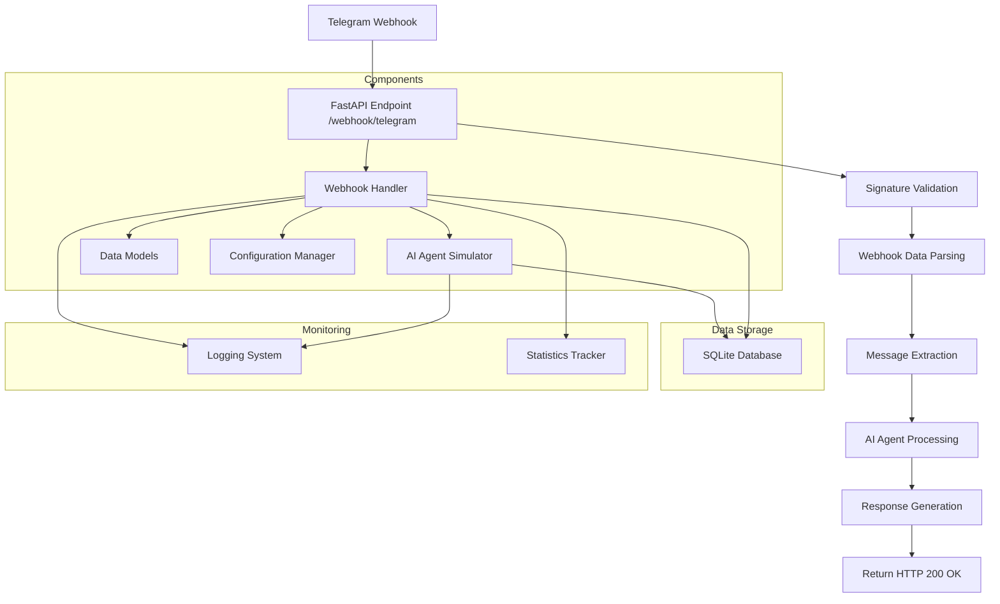

# Архитектура микросервиса обработки вебхуков

## Схема обработки запросов

## Компоненты системы

### 1. Webhook Receiver (main.py)
- **Назначение**: Прием HTTP POST запросов от Telegram
- **Технологии**: FastAPI, Uvicorn
- **Функции**: 
  - Валидация входящих запросов
  - Rate limiting
  - Логирование всех операций

### 2. Webhook Processor (webhook_handler.py)
- **Назначение**: Обработка и валидация данных вебхука
- **Функции**:
  - Парсинг JSON данных
  - Валидация структуры сообщения
  - Извлечение текста и метаданных
  - Подготовка данных для AI-агента

### 3. AI Agent Interface (ai_agent.py)
- **Назначение**: Имитация AI-агента для обработки сообщений
- **Функции**:
  - Генерация ответов на основе входного текста
  - Статистика обработки
  - Эмуляция времени обработки

### 4. Data Models (models.py)
- **Назначение**: Определение структур данных
- **Компоненты**:
  - Модели Telegram объектов
  - Модели запросов/ответов
  - Валидация данных

### 5. Configuration (config.py)
- **Назначение**: Управление конфигурацией сервиса
- **Параметры**:
  - Параметры сервера
  - Настройки безопасности
  - Лимиты и таймауты

## Поток данных

1. **Прием вебхука**: Telegram отправляет POST-запрос на `/webhook/telegram`
2. **Валидация**: Сервис проверяет подпись и структуру запроса
3. **Обработка**: Извлекаются данные сообщения и метаданные
4. **Передача AI**: Данные отправляются в AI-агент для обработки
5. **Ответ**: Формируется и возвращается HTTP 200 OK
6. **Логирование**: Все операции записываются в логи

## Технические решения

### База данных
- **Выбор**: SQLite
- **Обоснование**: Простота, отсутствие внешних зависимостей, достаточность для низкой нагрузки

### Протоколы
- **HTTP/HTTPS**: Стандартный протокол для вебхуков
- **REST API**: Для внутреннего взаимодействия компонентов

### Безопасность
- **Signature validation**: Проверка подписи вебхуков
- **Rate limiting**: Ограничение 100 запросов в минуту
- **Input validation**: Валидация всех входных данных

### Мониторинг
- **Логирование**: Все операции логируются
- **Статистика**: Подсчет обработанных запросов и ошибок
- **Health checks**: Эндпоинты для проверки состояния сервиса